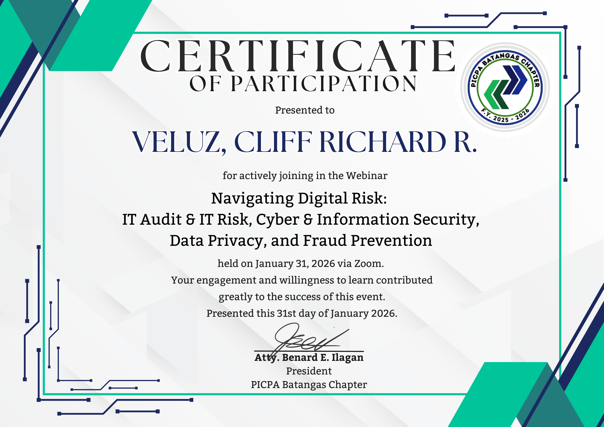
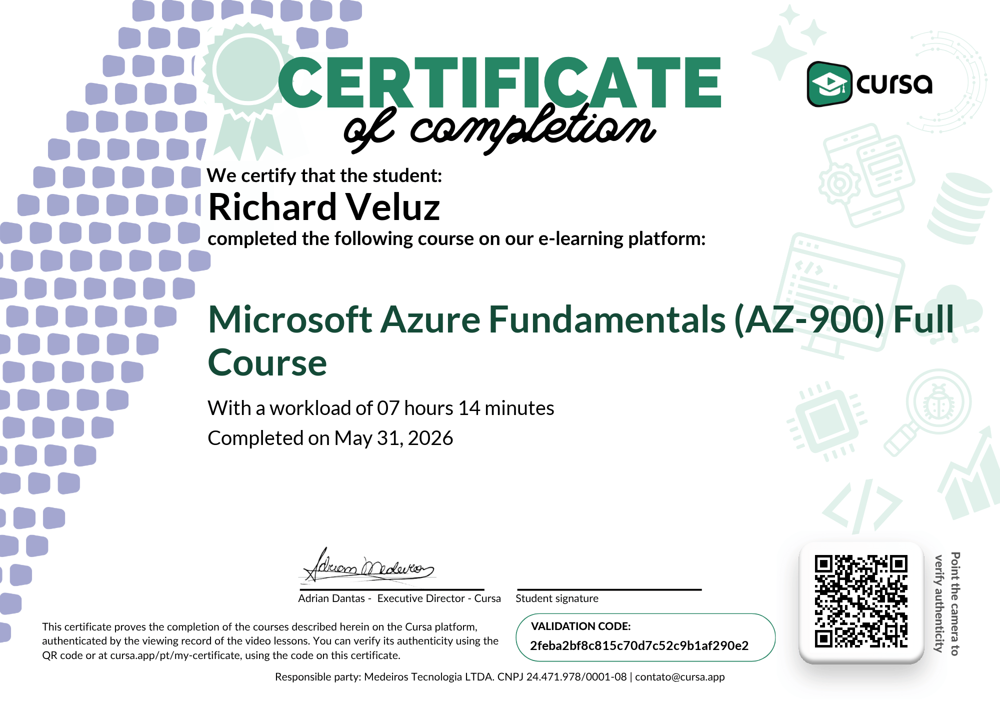

## 👦🏻 About Me:
---

💻 I'm a 23-year-old developer passionate about designing mobile systems and e-commerce platforms.

✨ I enjoy turning ideas into useful and creative applications, establishing solid conceptual frameworks, and continuously improving my technical skills through practical projects and academic research.

**Interests:**

* Mobile Application Development
* E-commerce Platforms
* Database Management
* Academic Research & Documentation
* Continuous Learning

📬 Always open to learning, collaborating, and creating meaningful projects.
---

## 🎯 Career Goals:
---

* **Build Impactful Mobile Applications:** Focus on developing intuitive and efficient mobile systems that deliver seamless user experiences.
* **Develop Robust E-commerce Platforms:** Architect and manage the backend logic and database systems that power modern online storefronts.
* **Bridge Research and Development:** Apply rigorous academic research, conceptual frameworks, and technical documentation to real-world software engineering.
* **Prioritize Security and Scalability:** Integrate cybersecurity best practices into everyday development while continuously expanding my technical skill set.

🚀 Dedicated to building systems that are both conceptually sound and technically resilient.
---

## 🛠️ Current Skills:
---

**Software & Application Development:**
* Designing and structuring mobile systems
* E-commerce platform development (Frontend structuring and Backend logic)

## 💻 Current Skills:
---
###🌐 Web & Programming
*HTML
*CSS
*JavaScript
*Python
*Java
*PHP

### 📱 Application & System Development
* Mobile Application Architecture
* E-commerce Platform Development
* Frontend Content Structuring
* Application Feature Planning

### 🗄️ Backend & Data Management
* Database Management 
* Structured Query Execution
* Backend Logic Development
* Cybersecurity Fundamentals

### 🛠️ Tools & Platforms
* GitHub
* Canva
* Figma
* MySQL
* XAMPP
* PhpMyAdmin
* Notion

## 🌐 Contact Information:
---

 

## 💻 Tech Stack:
---

---

## 📜 Certificates

Below are my certificates from the `Certificates` folder. Image files are displayed inline; PDF and other files are linked for download.

### Image Certificates

### PDF & Other Certificates

- [AWS SimuLearn_ Cloud_Veluz.pdf](Certificates/AWS%20SimuLearn_%20Cloud_Veluz.pdf)
- [AWS SimuLearn_ Computing_Veluz.pdf](Certificates/AWS%20SimuLearn_%20Computing_Veluz.pdf)
- [ComputerHardwareBasicsUpdate20260225-32-j737n6.pdf](Certificates/ComputerHardwareBasicsUpdate20260225-32-j737n6.pdf)
- [Computer_Hardware_Basics_certificate_veluz-richard-gmail-com_7053ef71-72b3-49ee-be8b-1e20a95a5ea3.pdf](Certificates/Computer_Hardware_Basics_certificate_veluz-richard-gmail-com_7053ef71-72b3-49ee-be8b-1e20a95a5ea3.pdf)
- [CreateDigitalContentUpdate20260225-31-2y1eox.pdf](Certificates/CreateDigitalContentUpdate20260225-31-2y1eox.pdf)
- [Digital_Safety_and_Security_Awareness_certificate_veluz-richard-gmail-com_29cea8ea-322d-4a59-b523-f5916fcc42ff.pdf](Certificates/Digital_Safety_and_Security_Awareness_certificate_veluz-richard-gmail-com_29cea8ea-322d-4a59-b523-f5916fcc42ff.pdf)
- [Networking_Basics_certificate_veluz-richard-gmail-com_0003efc3-4773-4083-a988-6438a68cd011.pdf](Certificates/Networking_Basics_certificate_veluz-richard-gmail-com_0003efc3-4773-4083-a988-6438a68cd011.pdf)
- [Networking_Devices_and_Initial_Configuration_certificate_veluz-.pdf](Certificates/Networking_Devices_and_Initial_Configuration_certificate_veluz-.pdf)
- [Network_Addressing_and_Basic_Troubleshooting_certificate_veluz-richard-gmail-com_03d4750a-f5a0-4519-bb1e-0ddd041bb92b.pdf](Certificates/Network_Addressing_and_Basic_Troubleshooting_certificate_veluz-richard-gmail-com_03d4750a-f5a0-4519-bb1e-0ddd041bb92b.pdf)
- [Network_Defense_certificate_shiellarico21-gmail-com_687a0456-6b7e-4e98-84c5-7256ae3f1114.pdf](Certificates/Network_Defense_certificate_shiellarico21-gmail-com_687a0456-6b7e-4e98-84c5-7256ae3f1114.pdf)
- [Network_Defense_certificate_shiellarico21-gmail-com_9f22a3fe-397d-4e92-9796-f7c974fd9362.pdf](Certificates/Network_Defense_certificate_shiellarico21-gmail-com_9f22a3fe-397d-4e92-9796-f7c974fd9362.pdf)
- [Network_Defense_certificate_veluz-richard-gmail-com_f7360ca6-e2b1-4f77-9278-706632f6db8e.pdf](Certificates/Network_Defense_certificate_veluz-richard-gmail-com_f7360ca6-e2b1-4f77-9278-706632f6db8e.pdf)
- [PythonEssentials1Update20260225-31-lcsqu5.pdf](Certificates/PythonEssentials1Update20260225-31-lcsqu5.pdf)
- [VELUZ E-Certificate.pdf](Certificates/VELUZ E-Certificate.pdf)
- [_certificate_veluz-richard-gmail-com_77b256cc-14de-42ed-8c1c-500c0499ecca.pdf](Certificates/_certificate_veluz-richard-gmail-com_77b256cc-14de-42ed-8c1c-500c0499ecca.pdf)

